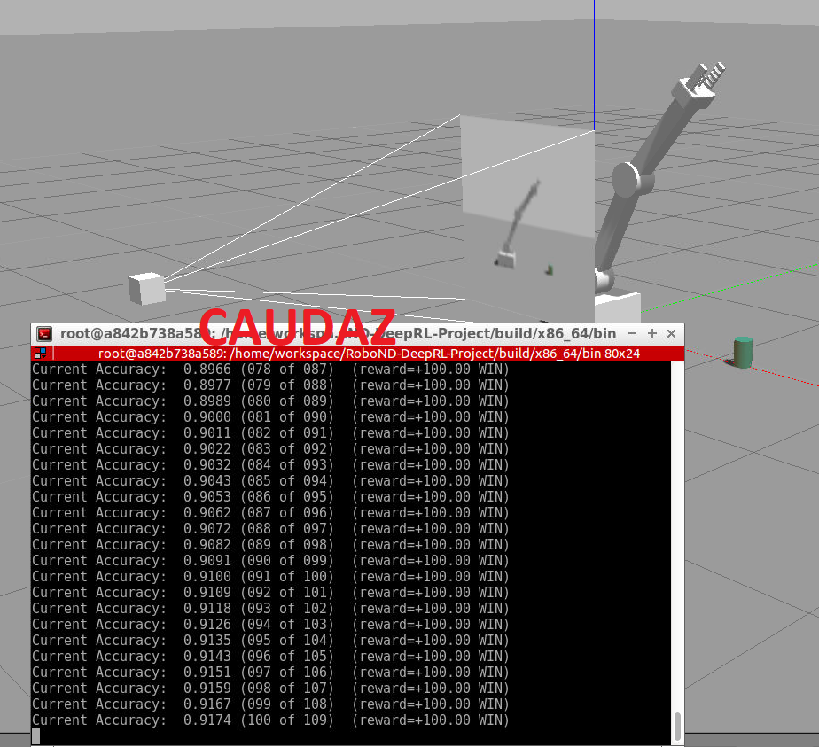
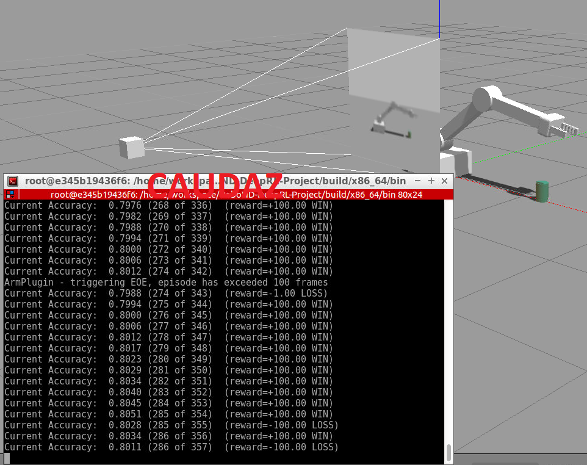
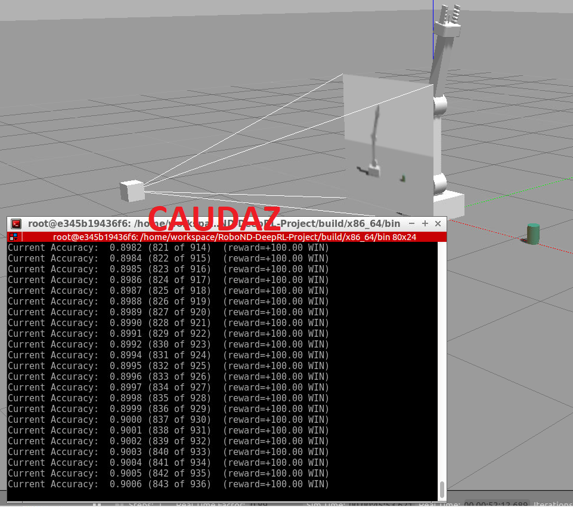

# <p align="center">Robotics Nanodegree</p> #

## <p align="center">Term2 – Project4: DeepRL Arm Manipulation</p>  ##


## ROS ##

Requirements to run this project locally are: CUDA Video Card and Jetpack installation from NVIDIA. This project was run on UDACITY's Workspaces:

1. gazebo/ArmPlugin.cpp was edited and compiled to run:
```
cd build
make
```

2. ROS/GAZEBO are run: 
```
cd build/x86_64/bin
./gazebo-arm.sh
```

NOTE: If having errors compiling C++ libraries, use:
```
sudo apt-get install libignition-math2-dev
```

<br><br>
## ABSTRACT ##

Deep Reinforcement Learning is an exciting field in Ai right now. It is used in Robotics, manufacturing, finance, etc. It teaches robots to learn from tasks in 2D and 3D worlds. On this particular project it is used with simulation of a ROS environment that has a camera tha creates a 2D image.  The Q value output of the neural network is a particular action, such as control of the robotic arm. It could be position, velocity, acceleration or a combination (this is selected by the user). The Deep Q-Network (DQN) uses a reward system that is defined by the user: reward if touching the robotic arm, negative reward if touching the ground, etc.

<br><br>
## INTRO ##

There are two primary objectives to the project -

* TASK#1 - Any part of the robot arm should touch the object with atleast an accuracy of 90%

* TASK#2 - Only the gripper base of the robot arm should touch the object with at least an accuracy of 80%<br><br>


The goal of this project was to create an API for ROS that includes a DQN agent following this process:

1. Subscribe to cameraNode and collisionNode topics

2. Create the DQN Agent

3. Use Velocity or Position based control for arm joints

4. Reward for robot gripper hitting the ground

5. Reward based on the distance to the object

6. Reward based on collision between the arm and the object (TASK#1)

7. Tune the hyperparameters

8. Reward based on collision between the arm’s gripper base and the object (TASK#2)

<br><br>
## BACKGROUND ##

Deep Q-Network(DQN) is used at the core of this project. It grabs an image from the camera that is fed into the Neural Network. It sses a memory bank of past actions (this is the reinforcement learning part). It uses a reward system to train the robot to touch the arm or the grip against the cylindrical object:

* possitive rewards are issued if collision of object with arm/grip

* interim reward based on distance to object (uses a smoothing function)

* negative rewards are issued if touching the ground, reaching a # of attempts

<br><br>
## RESULTS ##

Displacement based control was used for both tasks:
```
#define VELOCITY_CONTROL false
```
<br><br>

DQN API Settings were left untouched:
```
#define INPUT_CHANNELS 3
#define ALLOW_RANDOM true
#define DEBUG_DQN false
#define GAMMA     0.9f
#define EPS_START 0.90f
#define EPS_END   0.05f
#define EPS_DECAY 200
```
EPS START and END are the minimum probability that the arm will take a random action, and the DECAY is the number of episodes at which these START/END will occur. This is a good parameter to tune if you think the action needed for a positive reward is unlikely to happen. And the DECAY is used so that once the robot has "learned" not very many of these random actions occur.
<br><br>

The following hyperparameters were tuned:
* to obtain a smaller image from the camera that could be processed quickly:
```
#define INPUT_WIDTH   64        // 512
#define INPUT_HEIGHT  64        // 512
```
* RMSprop seemed to perform better than Adams for both tasks
```
#define OPTIMIZER     "RMSprop" //"None"
```
* Learning rate was 0.02 (slow) for task#1 and 0.15 (fast) for task#2 since there is much less contact area
```
#define LEARNING_RATE 0.02f     //0.0f
```
* Less memory (1000) was used for task#1 than for task#2 (10000) since small area of contact is less likely to occur
```
#define REPLAY_MEMORY 1000      //10000
```
* Small batch size of 16 was used for task#1 and high of 512 was used for task#2 (since the computer could handle it)
```
#define BATCH_SIZE    512        //8
```
* Long Short Term Memory was enabled and set to 256 for both tasks
``
#define USE_LSTM      true      //false
#define LSTM_SIZE     256       //32
```
<br><br>

Task#1 reached 90% accuracy at around 90 episodes:

<br><br>


Task#2 reached 80% accuracy at around 340 episodes:

Task#2 reached 90% accuracy at around 930 episodes:


<br><br>
## DISCUSSION ##

It took a much shorter number of episodes to reach task#1 than to reach task#2. The reason is the amount of contact area for task#1 was higher than for task#2 which was only the gripper.


<br><br>
## FUTURE WORK ##

This project could be enhanced to solve the following problems:

* Object Randomization :  will instantiate at different locations along the x-axis. Follow these steps and test your solution:

In PropPlugin.cpp, redefine the prop poses in PropPlugin::Randomize() to the following:
```
pose.pos.x = randf(0.02f, 0.30f);
pose.pos.y = 0.0f;
pose.pos.z = 0.0f;
```
In ArmPlugin.cpp, replace ResetPropDynamics(); set in the method ArmPlugin::updateJoints() with RandomizeProps();

* Increase Arm's Reach : allow the object’s starting location will be changed, and the arm will be allowed to rotate about its base:
1. In gazebo-arm.world, modify the tube model’s pose to [0.75 0.75 0 0 0 0]
2. In ArmPlugin.cpp, set the variable LOCKBASE to false.
3. In ArmPlugin.cpp, replace RandomizeProps(); set in the method ArmPlugin::updateJoints() with ResetPropDynamics();


<br><br><br><br>
# ---- FROM UDACITY GITHUB: Deep RL Arm Manipulation ----

This project is based on the Nvidia open source project "jetson-reinforcement" developed by [Dustin Franklin](https://github.com/dusty-nv). The goal of the project is to create a DQN agent and define reward functions to teach a robotic arm to carry out two primary objectives:

1. Have any part of the robot arm touch the object of interest, with at least a 90% accuracy.
2. Have only the gripper base of the robot arm touch the object, with at least a 80% accuracy.

## Building from Source (Nvidia Jetson TX2)

Run the following commands from terminal to build the project from source:

``` bash
$ sudo apt-get install cmake
$ git clone http://github.com/udacity/RoboND-DeepRL-Project
$ cd RoboND-DeepRL-Project
$ git submodule update --init
$ mkdir build
$ cd build
$ cmake ../
$ make
```

During the `cmake` step, Torch will be installed so it can take awhile. It will download packages and ask you for your `sudo` password during the install.

## Testing the API

To make sure that the reinforcement learners are still functioning properly from C++, a simple example of using the API called [`catch`](samples/catch/catch.cpp) is provided.  Similar in concept to pong, a ball drops from the top of the screen which the agent must catch before the ball reaches the bottom of the screen, by moving it's paddle left or right.

To test the textual [`catch`](samples/catch/catch.cpp) sample, run the following executable from the terminal.  After around 100 episodes or so, the agent should start winning the episodes nearly 100% of the time:  

``` bash
$ cd RoboND-DeepRL-Project/build/aarch64/bin
$ ./catch 
[deepRL]  input_width:    64
[deepRL]  input_height:   64
[deepRL]  input_channels: 1
[deepRL]  num_actions:    3
[deepRL]  optimizer:      RMSprop
[deepRL]  learning rate:  0.01
[deepRL]  replay_memory:  10000
[deepRL]  batch_size:     32
[deepRL]  gamma:          0.9
[deepRL]  epsilon_start:  0.9
[deepRL]  epsilon_end:    0.05
[deepRL]  epsilon_decay:  200.0
[deepRL]  allow_random:   1
[deepRL]  debug_mode:     0
[deepRL]  creating DQN model instance
[deepRL]  DQN model instance created
[deepRL]  DQN script done init
[cuda]  cudaAllocMapped 16384 bytes, CPU 0x1020a800000 GPU 0x1020a800000
[deepRL]  pyTorch THCState  0x0318D490
[deepRL]  nn.Conv2d() output size = 800
WON! episode 1
001 for 001  (1.0000)  
WON! episode 5
004 for 005  (0.8000)  
WON! episode 10
007 for 010  (0.7000)  
WON! episode 15
010 for 015  (0.6667)  
WON! episode 20
013 for 020  (0.6500)  13 of last 20  (0.65)  (max=0.65)
WON! episode 25
015 for 025  (0.6000)  11 of last 20  (0.55)  (max=0.65)
LOST episode 30
018 for 030  (0.6000)  11 of last 20  (0.55)  (max=0.65)
LOST episode 35
019 for 035  (0.5429)  09 of last 20  (0.45)  (max=0.65)
WON! episode 40
022 for 040  (0.5500)  09 of last 20  (0.45)  (max=0.65)
LOST episode 45
024 for 045  (0.5333)  09 of last 20  (0.45)  (max=0.65)
WON! episode 50
027 for 050  (0.5400)  09 of last 20  (0.45)  (max=0.65)
WON! episode 55
031 for 055  (0.5636)  12 of last 20  (0.60)  (max=0.65)
LOST episode 60
034 for 060  (0.5667)  12 of last 20  (0.60)  (max=0.65)
WON! episode 65
038 for 065  (0.5846)  14 of last 20  (0.70)  (max=0.70)
WON! episode 70
042 for 070  (0.6000)  15 of last 20  (0.75)  (max=0.75)
LOST episode 75
045 for 075  (0.6000)  14 of last 20  (0.70)  (max=0.75)
WON! episode 80
050 for 080  (0.6250)  16 of last 20  (0.80)  (max=0.80)
WON! episode 85
055 for 085  (0.6471)  17 of last 20  (0.85)  (max=0.85)
WON! episode 90
059 for 090  (0.6556)  17 of last 20  (0.85)  (max=0.85)
WON! episode 95
063 for 095  (0.6632)  18 of last 20  (0.90)  (max=0.90)
WON! episode 100
068 for 100  (0.6800)  18 of last 20  (0.90)  (max=0.90)
WON! episode 105
073 for 105  (0.6952)  18 of last 20  (0.90)  (max=0.90)
WON! episode 110
078 for 110  (0.7091)  19 of last 20  (0.95)  (max=0.95)
WON! episode 111
079 for 111  (0.7117)  19 of last 20  (0.95)  (max=0.95)
WON! episode 112
080 for 112  (0.7143)  20 of last 20  (1.00)  (max=1.00)
```

Internally, [`catch`](samples/catch/catch.cpp) is using the [`dqnAgent`](c/dqnAgent.h) API from our C++ library to implement the learning.


## Project Environment

To get started with the project environment, run the following:

``` bash
$ cd RoboND-DeepRL-Project/build/aarch64/bin
$ ./gazebo-arm.sh
```


The plugins which hook the learning into the simulation are located in the `gazebo/` directory of the repo. The RL agent and the reward functions are to be defined in [`ArmPlugin.cpp`](gazebo/ArmPlugin.cpp).
